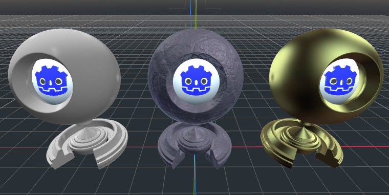
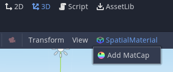
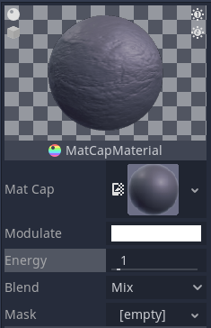

# MatCap Plugin

Hello fellow Godot users! I made a plugin that you might find useful. The MatCap Plugin is a feature pack that gives you access to MatCapping materials in a user-friendly way. This is useful for previewing object shading, or even for cheap lighting like back in the old days.

## Installation
Installing this plugin is simple. Just move the contents of the `addons` folder into your own. Don't have one? Make one. After that, you go to the Project Settings and enable the add-on from there. Done! Now you can use it.

## Usage
To start using MatCaps, just select a `SpatialMaterial`, press the corresponding button that appears and press, `Add MatCap`. Same procedure for removing one too.

Once that's done, you can start setting up its properties.

A `MatCapMaterial` is an extension of a `SpatialMaterials`. It includes the following properties.

* `mat_cap`: The MatCap texture to use in this material.
* `modulate`: The color said texture will be multiplied by. With a MatCap blend other than `None`, the alpha channel determines how much of the matcap will appear.
* `energy`: How strong the MatCap will be.
* `mask`: A texture that determines where the MatCap appears on the material. It has no effect if the MatCap's blend is `None`.
* `blend`: How the MatCap should be applied along with the base `SpatialMaterial`. Not to be confused with base material's `blend mode`. There are five available modes.
   * `None`: Only the MatCap will be visible. It's the only mode that the mask has no effect on.
   * `Mix`: The MatCap is mixed with the base material.
   * `Add`: The MatCap is added on top of the base material.
   * `Subtract`: The MatCap is subtracted from the base material.
   * `Multiply`: The base material's albedo and emission is multiplied with the MatCap.

 
